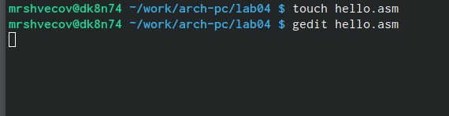
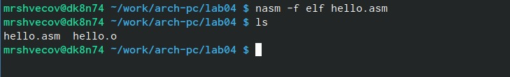
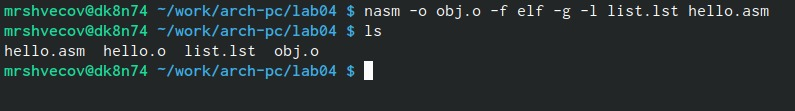
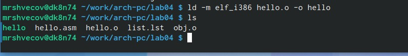
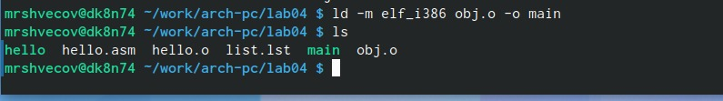
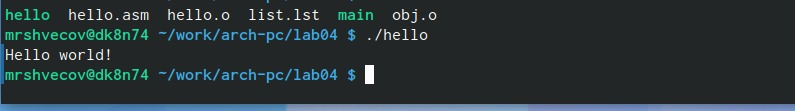
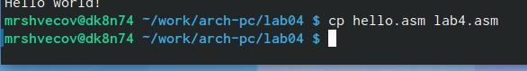
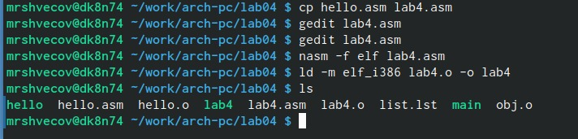
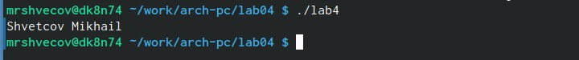
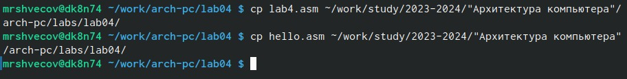

---
## Front matter
title: "ОТЧЕТ
ПО ЛАБОРАТОРНОЙ РАБОТЕ № 4"
subtitle: "Дисциплина: Архитектура компьютера"
author: "Швецов М. Р."

## Generic otions
lang: ru-RU
toc-title: "Содержание"

## Bibliography
bibliography: bib/cite.bib
csl: pandoc/csl/gost-r-7-0-5-2008-numeric.csl

## Pdf output format
toc: true # Table of contents
toc-depth: 2
lof: true # List of figures
lot: true # List of tables
fontsize: 12pt
linestretch: 1.5
papersize: a4
documentclass: scrreprt
## I18n polyglossia
polyglossia-lang:
  name: russian
  options:
	- spelling=modern
	- babelshorthands=true
polyglossia-otherlangs:
  name: english
## I18n babel
babel-lang: russian
babel-otherlangs: english
## Fonts
mainfont: PT Serif
romanfont: PT Serif
sansfont: PT Sans
monofont: PT Mono
mainfontoptions: Ligatures=TeX
romanfontoptions: Ligatures=TeX
sansfontoptions: Ligatures=TeX,Scale=MatchLowercase
monofontoptions: Scale=MatchLowercase,Scale=0.9
## Biblatex
biblatex: true
biblio-style: "gost-numeric"
biblatexoptions:
  - parentracker=true
  - backend=biber
  - hyperref=auto
  - language=auto
  - autolang=other*
  - citestyle=gost-numeric
## Pandoc-crossref LaTeX customization
figureTitle: "Рис."
tableTitle: "Таблица"
listingTitle: "Листинг"
lofTitle: "Список иллюстраций"
lotTitle: "Список таблиц"
lolTitle: "Листинги"
## Misc options
indent: true
header-includes:
  - \usepackage{indentfirst}
  - \usepackage{float} # keep figures where there are in the text
  - \floatplacement{figure}{H} # keep figures where there are in the text
---

# Цель работы
Освоить процедуры компиляции и сборки программ, написанных на ассемблере NASM.

# Задание

Создать программу, котрая будет выводить строку со словами.

# Выполнение лабораторной работы
Я создал каталог для работы с программами на языке ассемблера NASМ и перешел в него.

{#fig:001 width=70%}

Создал текстовый файл с именем hello.asm  и открыл его с помощью gedit.

{#fig:001 width=70%}

Я скомпилировал текст программы в обьектный код и проверил наличие созданного файла .о.

{#fig:001 width=70%}

 Я выполнил команду, которая скомпилирует исходный файл hello.asm в obj.o и проверил правильность выполнения команды.

{#fig:001 width=70%}

 Я скомпоновал объектный файл, отдав его компоновщку и проверил.

{#fig:001 width=70%}

Выполнил следующую команду:
ld -m elf_i386 obj.o -o main.

{#fig:001 width=70%}
Исполняемый файл будет иметь имя main. Объектный файл будет иметь имя obj.o.

Запустил на выполнение созданный исполняемый файл.

{#fig:001 width=70%}

#Выполненеи заданий для самостоятельной работы
С помощью ср скопировал файл hello.asm в файл lab4.asm

{#fig:001 width=70%}

С помощью gedit открыл новый файл и изменил его так, чтобы он выводил мои имя и фамилию, далее я его скомпилировал и скомпонавал.

{#fig:001 width=70%}

Запустил lab4

{#fig:001 width=70%}

Скопировал оба файла в локальнфй репозиторий.

{#fig:001 width=70%}
# Выводы

Я освоил компиляцию и сборку программ, написанных на ассемблере NASM.

# Список литературы{.unnumbered}

::: {#refs}
:::
