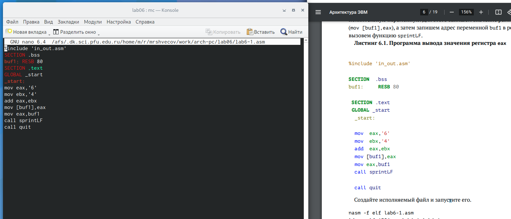
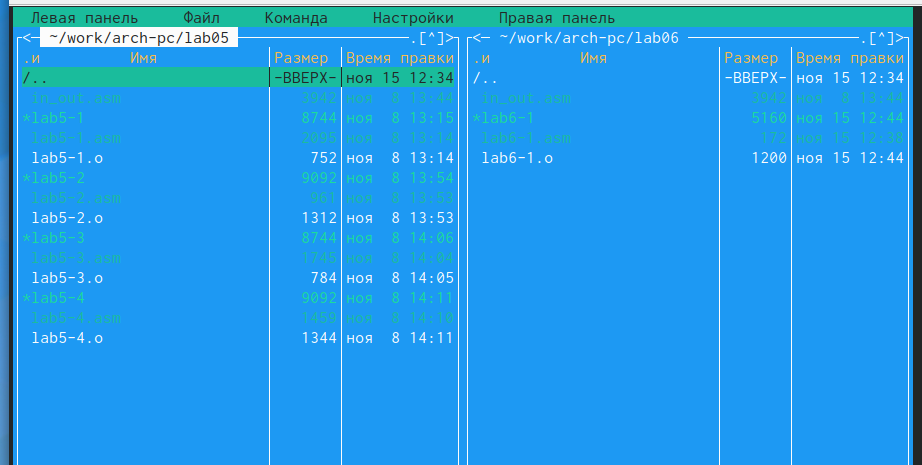
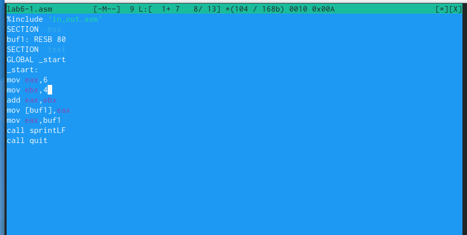
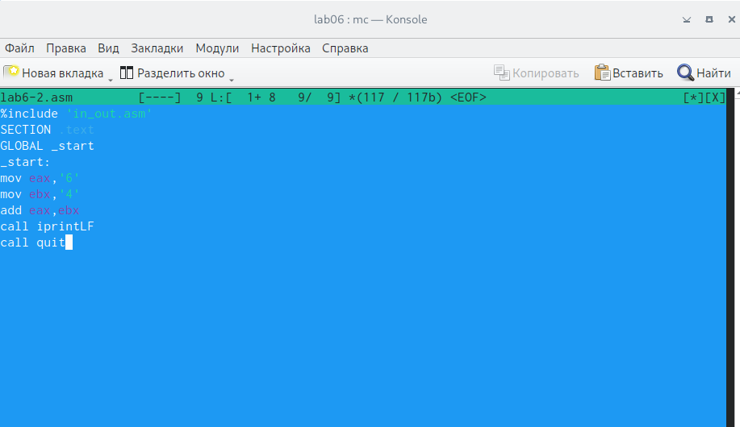
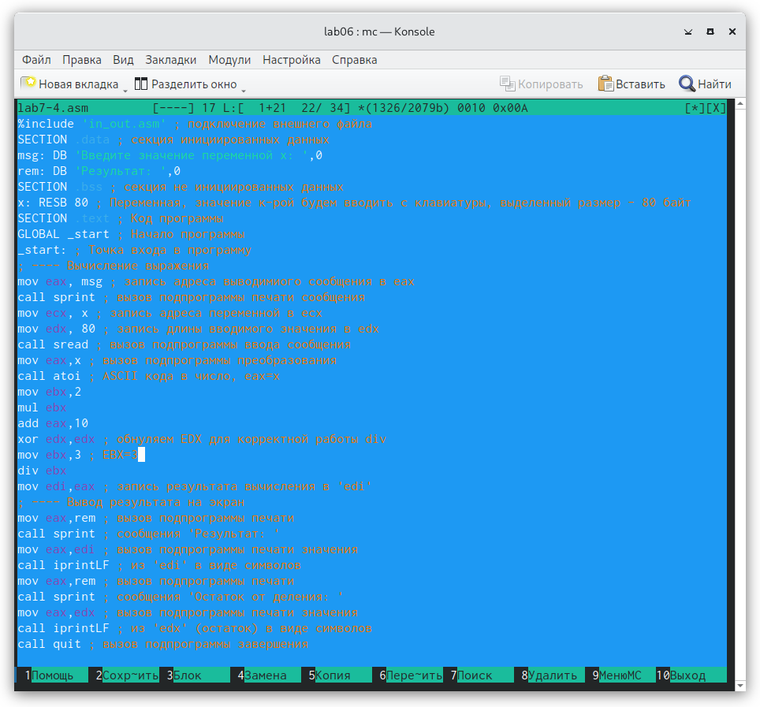

---
## Front matter
title: "Отчет по лабораторной работе №6"
subtitle: "Дисциплина: архитектура компьютера"
author: "Швецов Михаил Романович"

## Generic otions
lang: ru-RU
toc-title: "Содержание"

## Bibliography
bibliography: bib/cite.bib
csl: pandoc/csl/gost-r-7-0-5-2008-numeric.csl

## Pdf output format
toc: true # Table of contents
toc-depth: 2
lof: true # List of figures
lot: true # List of tables
fontsize: 12pt
linestretch: 1.5
papersize: a4
documentclass: scrreprt
## I18n polyglossia
polyglossia-lang:
  name: russian
  options:
	- spelling=modern
	- babelshorthands=true
polyglossia-otherlangs:
  name: english
## I18n babel
babel-lang: russian
babel-otherlangs: english
## Fonts
mainfont: PT Serif
romanfont: PT Serif
sansfont: PT Sans
monofont: PT Mono
mainfontoptions: Ligatures=TeX
romanfontoptions: Ligatures=TeX
sansfontoptions: Ligatures=TeX,Scale=MatchLowercase
monofontoptions: Scale=MatchLowercase,Scale=0.9
## Biblatex
biblatex: true
biblio-style: "gost-numeric"
biblatexoptions:
  - parentracker=true
  - backend=biber
  - hyperref=auto
  - language=auto
  - autolang=other*
  - citestyle=gost-numeric
## Pandoc-crossref LaTeX customization
figureTitle: "Рис."
tableTitle: "Таблица"
listingTitle: "Листинг"
lofTitle: "Список иллюстраций"
lotTitle: "Список таблиц"
lolTitle: "Листинги"
## Misc options
indent: true
header-includes:
  - \usepackage{indentfirst}
  - \usepackage{float} # keep figures where there are in the text
  - \floatplacement{figure}{H} # keep figures where there are in the text
---

# Цель работы

Цель данной лабораторной работы - освоение арифметческих инструкций
языка ассемблера NASM.

# Задание

Здесь приводится описание задания в соответствии с рекомендациями
методического пособия и выданным вариантом.

# Теоретическое введение

Здесь описываются теоретические аспекты, связанные с выполнением работы.

Например, в табл. @tbl:std-dir приведено краткое описание стандартных каталогов Unix.

: Описание некоторых каталогов файловой системы GNU Linux {#tbl:std-dir}

| Имя каталога | Описание каталога                                                                                                          |
|--------------|----------------------------------------------------------------------------------------------------------------------------|
| `/`          | Корневая директория, содержащая всю файловую                                                                               |
| `/bin `      | Основные системные утилиты, необходимые как в однопользовательском режиме, так и при обычной работе всем пользователям     |
| `/etc`       | Общесистемные конфигурационные файлы и файлы конфигурации установленных программ                                           |
| `/home`      | Содержит домашние директории пользователей, которые, в свою очередь, содержат персональные настройки и данные пользователя |
| `/media`     | Точки монтирования для сменных носителей                                                                                   |
| `/root`      | Домашняя директория пользователя  `root`                                                                                   |
| `/tmp`       | Временные файлы                                                                                                            |
| `/usr`       | Вторичная иерархия для данных пользователя                                                                                 |

Более подробно об Unix см. в [@gnu-doc:bash;@newham:2005:bash;@zarrelli:2017:bash;@robbins:2013:bash;@tannenbaum:arch-pc:ru;@tannenbaum:modern-os:ru].

# Выполнение лабораторной работы

Создал директорию, в которой буду создавать файлы
с программами для лабораторной работы №6  Перехожу в созданный
каталог с помощью команды cd. И создаю файл lab6-1.asm

{#fig:001 width=70%}

Открываю созданный файл lab6-1.asm, вставляю в него программу вывода
значения регистра eax

{#fig:001 width=70%}

Скопировал файл in_out.asm в директорию lab06 

{#fig:001 width=70%}

Создаю исполняемый файл программы и запускаю его. Вывод программы: символ j, потому что программа вывела символ, соответствующий по
системе ASCII сумме двоичных кодов символов 4 и 6.

{#fig:001 width=70%}

Изменяю в тексте программы символы “6” и “4” на цифры 6 и 4

{#fig:001 width=70%}

Создаю новый исполняемый файл программы и запускаю его. Теперь вывелся символ с кодом 10, это символ перевода строки, этот символ не
отображается при выводе на экран.

{#fig:001 width=70%}

Создал новый файл lab7-2.asm с помощью утилиты touch и ввожу в файл текст другойпрограммы для вывода значения регистра eax

{#fig:001 width=70%}

Создаю и запускаю исполняемый файл lab6-2. Теперь вывод число
106, потому что программа позволяет вывести именно число, а не символ, хотя
все еще происходит именно сложение кодов символов “6” и “4”.

{#fig:001 width=70%}

Заменил в тексте программы в файле lab6-2.asm символы “6” и “4” на числа 6
и 4. Создаю и запускаю новый исполняемый файл. Теперь программа
складывает не соответствующие символам коды в системе ASCII, а сами числа,
поэтому вывод 10.

{#fig:001 width=70%}

Создал файл lab6-3.asm с помощью утилиты touch.  Ввожу в созданный файл текст программы для вычисления значения выражения f(x) = (5 * 2 + 3)/3. Создаю исполняемый файл и запускаю его

{#fig:001 width=70%}

Изменяю программу так, чтобы она вычисляла значение выражения f(x) = (4 *
6 + 2)/5, создаю и запускаю новый исполняемый файл (рис. 4.19). Я посчитал для проверки правильности работы программы значение выражения самостоятельно,
программа отработала верно.

{#fig:001 width=70%}

Создал файл variant.asm с помощью утилиты touch, ввел в файл текст программы для вычисления варианта задания по номеру
студенческого билета. Создаю и запускаю исполняемый файл (рис. 4.22). Ввожу номер своего студ.
билета с клавиатуры, программа вывела, что мой вариант - 1.

{#fig:001 width=70%}

Ответы на вопросы:

1. За вывод сообщения “Ваш вариант” отвечают строки кода:
mov eax,rem
call sprint
2. Инструкция mov ecx, x используется, чтобы положить адрес вводимой строки x в регистр ecx mov edx, 80 - запись в регистр edx длины вводимой строки
call sread - вызов подпрограммы из внешнего файла, обеспечивающей ввод
сообщения с клавиатуры
3. call atoi используется для вызова подпрограммы из внешнего файла, которая преобразует ascii-код символа в целое число и записывает результат в
регистр eax
4. За вычисления варианта отвечают строки:
xor edx,edx ; обнуление edx для корректной работы div
mov ebx,20 ; ebx = 20
div ebx ; eax = eax/20, edx - остаток от деления
inc edx ; edx = edx + 1
5. При выполнении инструкции div ebx остаток от деления записывается в
регистр edx
6. Инструкция inc edx увеличивает значение регистра edx на 1
7. За вывод на экран результатов вычислений отвечают строки:
mov eax,edx
call iprintLF

Задания для самостоятельной работы:

Создаю файл lab6-4.asm с помощью утилиты touch. Открываю созданный файл для редактирования, ввожу в него текст программы
для вычисления значения выражения (10 + 2𝑥)/3 . Это выражение
было под вариантом 1.

{#fig:001 width=70%}

Создаю и запускаю исполняемый файл. При вводе значения 1, вывод
- 4.

{#fig:001 width=70%}

Провожу еще один запуск исполняемого файла для проверки работы программы с другим значением на входе. Программа отработала верно.

{#fig:001 width=70%}

Листинг 4.1. Программа для вычисления выражения (10 + 2х)/3.

%include 'in_out.asm' ; подключение внешнего файла

SECTION .data ; секция инициированных данных

msg: DB 'Введите значение переменной х: ',0

rem: DB 'Результат: ',0

SECTION .bss ; секция не инициированных данных

x: RESB 80 ; Переменная, значение к-рой будем вводить с клавиатуры, выделенный размер - 80 байт

SECTION .text ; Код программы

GLOBAL _start ; Начало программы

_start: ; Точка входа в программу

; ---- Вычисление выражения

mov eax, msg ; запись адреса выводимиого сообщения в eax

call sprint ; вызов подпрограммы печати сообщения

mov ecx, x ; запись адреса переменной в ecx

mov edx, 80 ; запись длины вводимого значения в edx

call sread ; вызов подпрограммы ввода сообщения

mov eax,x ; вызов подпрограммы преобразования

call atoi ; ASCII кода в число, eax=x

mov ebx,2

mul ebx

add eax,10

xor edx,edx ; обнуляем EDX для корректной работы div

mov ebx,3 ; EBX=3

div ebx

mov edi,eax ; запись результата вычисления в 'edi'

; ---- Вывод результата на экран

mov eax,rem ; вызов подпрограммы печати

call sprint ; сообщения 'Результат: '

mov eax,edi ; вызов подпрограммы печати значения

call iprintLF ; из 'edi' в виде символов

mov eax,rem ; вызов подпрограммы печати

call sprint ; сообщения 'Остаток от деления: '

mov eax,edx ; вызов подпрограммы печати значения

call iprintLF ; из 'edx' (остаток) в виде символов

call quit ; вызов подпрограммы завершения

# Выводы

При выполнении данной лабораторной работы я освоил арифметические
инструкции языка ассемблера NASM.

# Список литературы{.unnumbered}

::: {#refs}
:::
